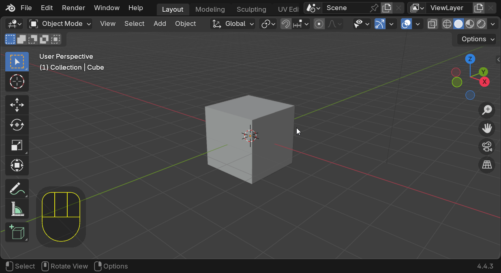
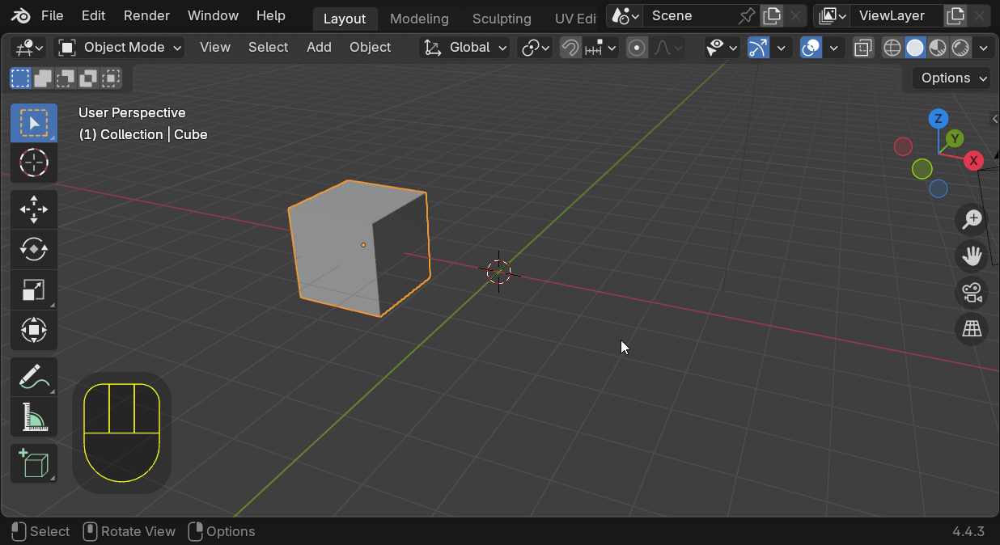
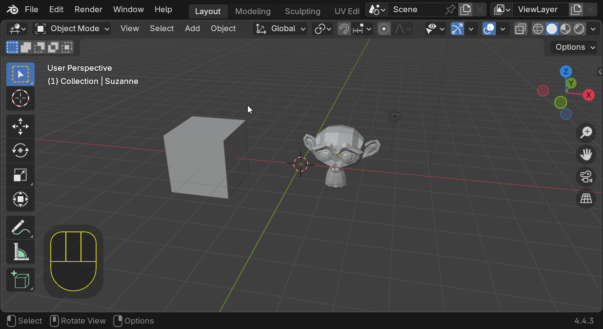

# Blender Guide

Simple beginners guide
GIFs are around 14 to 20 seconds each

## Top
Topbar and Workspaces

## Areas & Editors
#### Areas are areas... where you can view *Editors* such as the *3D Viewport* or the *Timeline*

#### Find all the Editors by pressing the icon on the top left of the Area

### You can move them around, dulpicate and delete
You can even save the layout in the [Workspaces](#Top), but that comes later

## Move (G) and Scale (S)
After pressing you can guide the change to one of the XYZ axis

## Adding Objects (Shift+A)

## Switch Modes (TAB) and Select All (A)

## Edit mode
In edit mode you can select by vertices, edges or faces

## The Camera
### This is how your final render will look like

## Useful things

## More info:
[Blender documentation](https://docs.blender.org/manual/en/latest/index.html)
