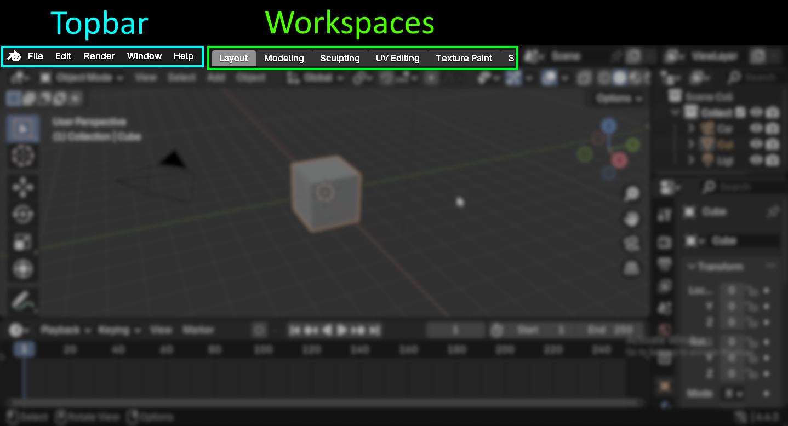
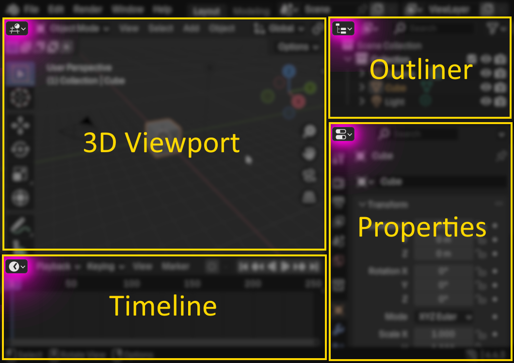
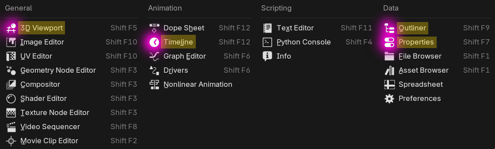

# Blender Guide

Simple beginners guide

## Top
Topbar and Workspaces

## Areas & Editors
#### Areas are areas... where you can view *Editors* such as the *3D Viewport* or the *Timeline*

### Available Editors:
#### (Find them by pressing the icon on the top left of the Area)

### You can move them around, dulpicate and delete
You can even save the layout the [Workspaces](##Top)

## More info:
[Blender documentation](https://docs.blender.org/manual/en/latest/index.html)
